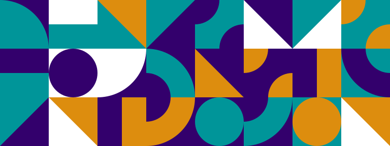

<p align="center">
  <a href="https://digitalwarenkombinat.github.io/grid/">
    
  </a>
</p>

---

## About [_Grid Art Designer_](https://digitalwarenkombinat.github.io/grid/)

Grid Art Designer allows users to create and download grid-based SVG artwork, with options to toggle filters and download the final image as an SVG or PNG.

Inspired from Alex Trosts article [Creating Generative SVG Grids](https://frontend.horse/articles/generative-grids/).

## Feedback

Feel free to send us feedback on [Instagram](https://www.instagram.com/digitalwarenkombinat/) or [file an issue](https://github.com/digitalwarenkombinat/glamorouseurope/issues/new). Feature requests are always welcome.

## Getting started

Run the following command on your local environment:

```
git clone --depth=1 https://github.com/digitalwarenkombinat/grid.git
cd grid
npm install
```

You can run the application in development mode with live reload:

```
npm run dev
```

Open http://localhost:3000 with your favorite browser to see the application.

```
.
├── README.md            # README file
├── next.config.js       # Next configuration
├── public               # Public folder for assets and fonts
├── src                  # UI components
└── tsconfig.json        # TypeScript configuration
```

You can see the results locally in production mode with:

```
npm run build
npm run start
```

The generated HTML and CSS files are minified (built-in feature from Next).
